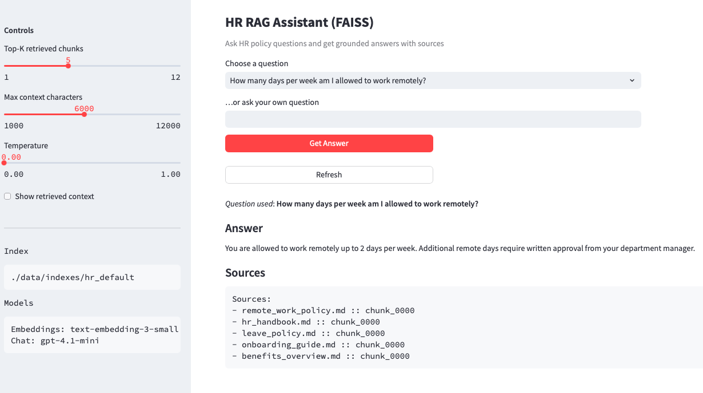

## HR RAG Assistant

### Overview

This project is the third installment in the AgenticAI Evolution series.

Project 1: focused on a fully deterministic pipeline for answering analytics questions.
Project 2: introduces LLMs as agents — specifically a Planner and a Narrator — while keeping execution and evidence strictly deterministic.
A lightweight Retrieval-Augmented Generation (RAG) assistant focused on HR policies and procedures. It ingests HR markdown documents, builds a small local index, and answers employee questions with citations grounded in the policy content.
Project 3 (this repo): A grounded, HR‑focused RAG assistant that turns policy documents into fast, trustworthy answers with clear citations for both employees and HR teams.

This project is a practical introduction to modern AI assistants built with Large Language Models (LLMs) and Retrieval-Augmented Generation (RAG). Instead of relying on an LLM’s memory alone, the system retrieves relevant HR policy snippets from a local index and asks the model to answer strictly from that context, producing grounded, concise responses with citations.

HR teams manage high-volume, policy-driven questions where accuracy and consistency matter. Employees need quick answers, but HR needs traceability and compliance. This project focuses on HR so the workflows, prompts, and data structures are opinionated around policy content, approvals, eligibility rules, and benefits—making it immediately useful and easy to extend for HR use cases.

### What it does
- Retrieves policy context from HR data/raw documents using a local vector index
- Answers questions with citations, enforcing “answer only from provided context”
- Provides a simple Streamlit UI for asking questions and reviewing sources
- Includes ingestion (clean, chunk, index)

### How it helps HR and employees
- HR benefits: consistent answers, reduced repetitive inquiries, clear source links for auditability, and an extensible foundation to add more policies or integrations.
- Employees benefit: fast, self-serve access to accurate policy details, with transparent sources they can verify.

### Quick start

- Clone the repository:
  ```bash
  git clone https://github.com/<you>/HR-RAG-Assistant.git
  cd HR-RAG-Assistant
  ```
- Install
  ```bash
  python3 -m pip install --upgrade pip
  python3 -m pip install -e .
  ```
- Create and populate your environment file based on `.env.example`.
- Put your HR policy sources in `data/raw/` (sample files are included).
- Ingest data to build/update a local index:
  ```bash
  python scripts/ingest_hr_docs.py
  ```
- Run the app:
  ```bash
  streamlit run app.py
  ```
- Ask a question, e.g. "Is there a budget for training or professional development?
    
### Project layout

<details>
<summary><b>data/indexes/hr_default/ (index artifacts)</b></summary>
<pre>
data/
└── indexes/
└── hr_default/
├── chunks.jsonl # chunk metadata/content (example format)
├── index.faiss # vector index (FAISS)
└── meta.json # index configuration / stats
</pre>
</details>
<details>
<summary><b>data/raw/ (HR policy sources ingested by RAG)</b></summary>
<pre>
data/
└── raw/
├── benefits_overview.md
├── hr_handbook.md
├── leave_policy.md
├── onboarding_guide.md
└── remote_work_policy.md
</pre>
</details>
<details>
<summary><b>src/hr_rag_assistant/ (core package)</b></summary>
src/
└── hr_rag_assistant/
└── retrieval/
├── init.py
├── prompts.py # “answer only from HR policy context”
├── retriever.py # similarity search top_k
└── vectorstore.py # load/save vector index abstraction
</pre>
data/indexes/hr_default
<pre>
data/
└── indexes/
└── hr_default/
├── chunks.jsonl
├── index.faiss
└── meta.json
</pre>
data/raw
<pre>
data/
└── raw/
├── benefits_overview.md
├── hr_handbook.md
├── leave_policy.md
├── onboarding_guide.md
└── remote_work_policy.md
</pre>
</details>

### Use Case


