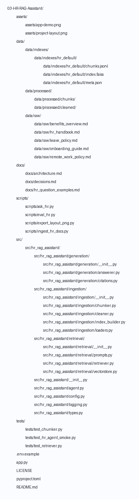

## HR RAG Assistant

A lightweight Retrieval-Augmented Generation (RAG) assistant focused on HR policies and procedures. It ingests HR markdown documents, builds a small local index, and answers employee questions with citations grounded in the policy content.

### Quick start
- Create and populate your environment file based on `.env.example`.
- Put your HR policy sources in `data/raw/` (sample files are included).
- Ingest data to build/update a local index:
  ```bash
  python scripts/ingest_hr_docs.py
  ```
- Ask a question:
  ```bash
  python scripts/ask_hr.py --question "How many PTO days do I get?"
  ```

### Project layout


### Notes
- `.env` is for local secrets and is git-ignored. Use `.env.example` for a safe template.
- The implementation is intentionally minimal to enable fast iteration. Replace stub logic with real embedding and vector search as needed.

### Use Case


